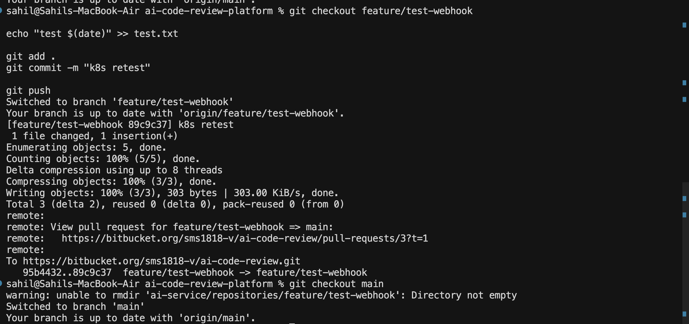
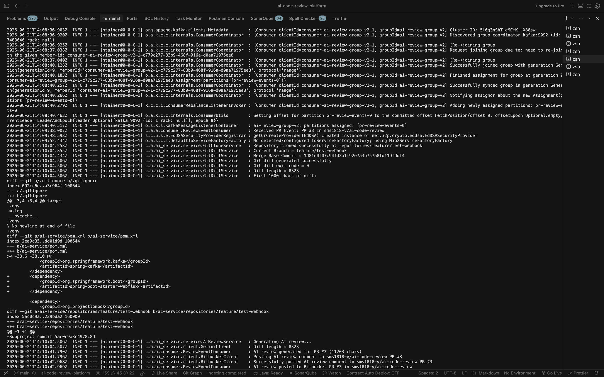
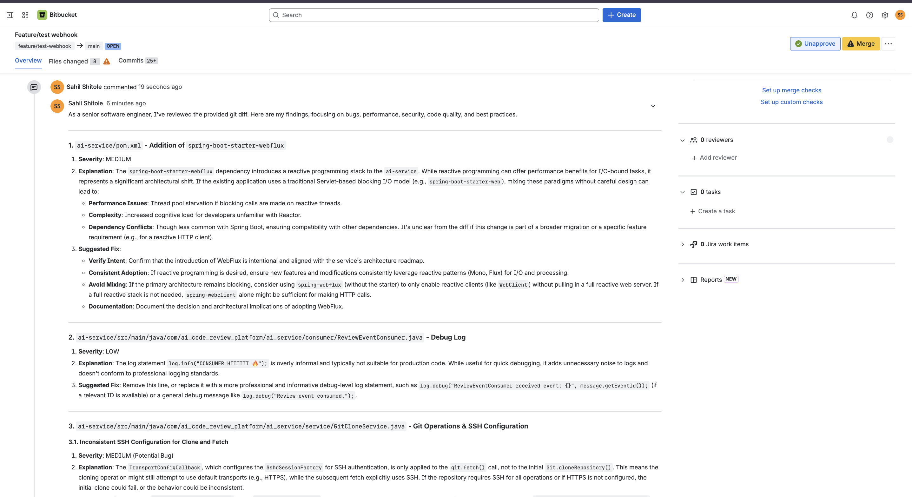
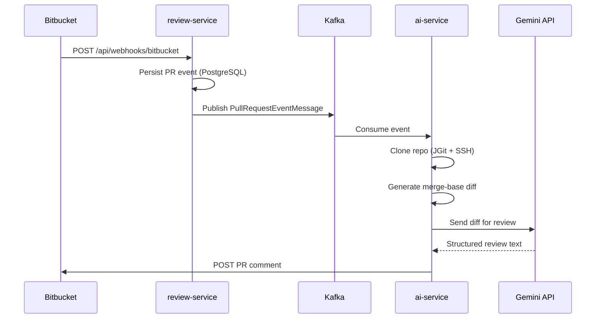

# AI Code Review Platform

An event-driven, microservices-based platform that automatically reviews Bitbucket pull requests using Google Gemini and posts structured feedback directly on the PR.

When a pull request is opened, the platform clones the repository, generates a merge-base git diff, sends it to Gemini for analysis, and publishes the review as a Bitbucket PR comment — fully asynchronously via Kafka.

---

## Screenshots

### Adding changes from another branch and creating a pull request



### AI Service Processing



### Comment added by Gemini into PR comment section in Bitbucket

## 

## Architecture

```
Bitbucket PR (webhook)
        │
        ▼
┌───────────────────┐
│ gateway-service   │  :8080  (K8s / production entry point)
│  Spring Cloud GW  │
└─────────┬─────────┘
          │  /api/webhooks/**
          ▼
┌───────────────────┐
│  review-service   │  :8082
│  Webhook + Kafka  │
└─────────┬─────────┘
          │  pr-review-events
          ▼
┌───────────────────┐
│    ai-service     │  :8083
│  Clone → Diff →   │
│  Gemini → Comment │
└─────────┬─────────┘
          │
          ▼
   Bitbucket PR comment
```



---

## Services

| Service             | Port   | Role                                                                               |
| ------------------- | ------ | ---------------------------------------------------------------------------------- |
| **review-service**  | `8082` | Receives Bitbucket webhooks, persists events, publishes to Kafka                   |
| **ai-service**      | `8083` | Consumes Kafka events, clones repo, generates diff, calls Gemini, posts PR comment |
| **gateway-service** | `8080` | API gateway (routes auth + webhook paths)                                          |
| **Kafka**           | `9092` | Async messaging (`pr-review-events` topic)                                         |
| **Zookeeper**       | `2181` | Kafka coordination                                                                 |

---

## Tech Stack

- **Java 21** · **Spring Boot 3.5**
- **Apache Kafka** — async event pipeline
- **PostgreSQL** — PR event persistence (review-service)
- **JGit** — SSH repository cloning
- **Google Gemini 2.5 Flash** — AI code review
- **Bitbucket REST API** — PR comment posting
- **Spring WebClient** — HTTP clients with retry + timeout
- **Docker** — containerized service deployment
- **Kubernetes** — orchestration and service management
- **Kubernetes Secrets** — secure credential management
- **Spring Cloud Gateway** — API routing
- **Ngrok** — local webhook exposure

---

## Prerequisites

- Java 21
- Docker & Docker Compose
- Maven (or use included `./mvnw` wrappers)
- SSH key configured for Bitbucket (`ssh -T git@bitbucket.org`)
- A public URL for webhooks (e.g. [ngrok](https://ngrok.com)) — Bitbucket cannot reach `localhost`

For Kubernetes deployment:

- [kubectl](https://kubernetes.io/docs/tasks/tools/)
- A local cluster (Docker Desktop Kubernetes, [minikube](https://minikube.sigs.k8s.io/), or [kind](https://kind.sigs.k8s.io/))

---

## Environment Variables

Add these to your shell profile (`~/.zshrc`) or export before starting services:

```bash
# Required — review-service
export DB_PASSWORD=your-postgres-password

# Required — ai-service
export GEMINI_API_KEY=your-gemini-api-key
export BITBUCKET_USERNAME=your-atlassian-email@example.com
export BITBUCKET_PASSWORD=your-bitbucket-api-token
```

| Variable             | Used by        | Description                                                                                      |
| -------------------- | -------------- | ------------------------------------------------------------------------------------------------ |
| `DB_PASSWORD`        | review-service | PostgreSQL database password                                                                     |
| `GEMINI_API_KEY`     | ai-service     | Google AI Studio API key                                                                         |
| `BITBUCKET_USERNAME` | ai-service     | Atlassian account email                                                                          |
| `BITBUCKET_PASSWORD` | ai-service     | Bitbucket API token ([create here](https://id.atlassian.com/manage-profile/security/api-tokens)) |

---

## Quick Start

### 1. Start infrastructure

```bash
cd ai-code-review-platform
docker compose up -d
```

### 2. Start review-service

```bash
cd review-service
./mvnw clean spring-boot:run
```

Wait for: `Started ReviewServiceApplication` on port **8082**.

### 3. Start ai-service

```bash
cd ai-service
./mvnw clean spring-boot:run
```

Wait for: `Started AiServiceApplication` on port **8083**.

> **Tip:** Always use `./mvnw clean spring-boot:run` after DTO or config changes to avoid stale classpath errors.

### 4. Expose the webhook endpoint (local dev)

When running services locally (not in Kubernetes), forward ngrok directly to review-service:

```bash
ngrok http 8082
```

Copy the HTTPS forwarding URL (e.g. `https://abc123.ngrok-free.app`).

> For the Kubernetes deployment path, use [Expose webhooks via ngrok (Kubernetes)](#expose-webhooks-via-ngrok-kubernetes) instead — ngrok forwards to **gateway-service** on port **8080**.

### 5. Configure Bitbucket webhook

In your Bitbucket repo → **Repository settings → Webhooks → Add webhook**:

| Field        | Value                                             |
| ------------ | ------------------------------------------------- |
| **Title**    | AI Code Review                                    |
| **URL**      | `https://<your-ngrok-url>/api/webhooks/bitbucket` |
| **Triggers** | Pull request created (optionally: updated)        |

### 6. Open a test pull request

```bash
git checkout -b feature/test-ai-review
# make a small code change
git add . && git commit -m "test: trigger AI review"
git push -u origin feature/test-ai-review
```

Open a PR in Bitbucket. Within a minute you should see an AI-generated comment on the pull request.

---

## Kubernetes Deployment

The `k8s/` folder contains manifests to run the full platform inside a cluster. All resources use the `**ai-review**` namespace.

### k8s/ layout

```
k8s/
├── gateway-deployment.yaml      # Spring Cloud Gateway (port 8080)
├── gateway-service.yaml
├── review-service-deployment.yaml
├── review-service-service.yaml
├── ai-service-deployment.yaml
├── ai-service-service.yaml
├── kafka-deployment.yaml
├── kafka-service.yaml
├── zookeeper-deployment.yaml
└── zookeeper-service.yaml
```

| Manifest                  | Kind                 | Purpose                                    |
| ------------------------- | -------------------- | ------------------------------------------ |
| `gateway-*`               | Deployment + Service | Routes `/api/webhooks/**` → review-service |
| `review-service-*`        | Deployment + Service | Webhook handler + Kafka producer           |
| `ai-service-*`            | Deployment + Service | Kafka consumer + Gemini + Bitbucket        |
| `kafka-*` / `zookeeper-*` | Deployment + Service | In-cluster messaging infrastructure        |

Gateway routing (from `gateway-service/src/main/resources/application.yml`):

- `/api/webhooks/**` → `http://review-service:8082`
- `/api/auth/**` → `http://auth-service:8081`

### 1. Create the namespace

```bash
kubectl create namespace ai-review
```

### 2. Create Kubernetes secrets

```bash
# review-service — PostgreSQL password
kubectl create secret generic review-service-secret \
  -n ai-review \
  --from-literal=DB_PASSWORD=your-postgres-password

# ai-service — Gemini + Bitbucket credentials
kubectl create secret generic ai-service-secret \
  -n ai-review \
  --from-literal=GEMINI_API_KEY=your-gemini-api-key \
  --from-literal=BITBUCKET_USERNAME=your-atlassian-email@example.com \
  --from-literal=BITBUCKET_PASSWORD=your-bitbucket-api-token

# ai-service — SSH key for JGit clone (private key file on your machine)
kubectl create secret generic ssh-keys \
  -n ai-review \
  --from-file=id_rsa=$HOME/.ssh/id_rsa \
  --from-file=id_rsa.pub=$HOME/.ssh/id_rsa.pub \
  --from-file=known_hosts=$HOME/.ssh/known_hosts
```

### 3. Build local Docker images

Manifests use `imagePullPolicy: Never` with tags like `ai-review/gateway-service:latest`, so images must exist in your cluster's Docker daemon (Docker Desktop / minikube / kind):

```bash
docker build -t ai-review/gateway-service:latest ./gateway-service
docker build -t ai-review/review-service:latest ./review-service
docker build -t ai-review/ai-service:latest ./ai-service
```

If using **minikube**, load images into the cluster after building:

```bash
minikube image load ai-review/gateway-service:latest
minikube image load ai-review/review-service:latest
minikube image load ai-review/ai-service:latest
```

### 4. Apply manifests

```bash
kubectl apply -f k8s/ -n ai-review
```

Verify pods are running:

```bash
kubectl get pods -n ai-review
kubectl get svc -n ai-review
```

### 5. Expose webhooks via ngrok (Kubernetes)

Bitbucket cannot reach services inside the cluster directly. Use **kubectl port-forward** to expose gateway-service locally, then tunnel that port with ngrok.

**Terminal 1** — forward the gateway Service to localhost:

```bash
kubectl port-forward -n ai-review svc/gateway-service 8080:8080
```

**Terminal 2** — start ngrok against the forwarded port:

```bash
ngrok http 8080
```

Copy the ngrok HTTPS URL and configure the Bitbucket webhook:

| Field        | Value                                             |
| ------------ | ------------------------------------------------- |
| **Title**    | AI Code Review                                    |
| **URL**      | `https://<your-ngrok-url>/api/webhooks/bitbucket` |
| **Triggers** | Pull request created (optionally: updated)        |

Traffic flow:

```
Bitbucket → ngrok (public HTTPS) → localhost:8080 → gateway-service (K8s) → review-service → Kafka → ai-service
```

### Useful kubectl commands

```bash
# Pod logs
kubectl logs -n ai-review -l app=review-service -f
kubectl logs -n ai-review -l app=ai-service -f
kubectl logs -n ai-review -l app=gateway-service -f

# Restart a deployment after image rebuild
kubectl rollout restart deployment/gateway-service -n ai-review
kubectl rollout restart deployment/review-service -n ai-review
kubectl rollout restart deployment/ai-service -n ai-review

# Tear down
kubectl delete namespace ai-review
```

---

## Kafka Event Schema

Topic: `pr-review-events`

```json
{
  "pullRequestId": 3,
  "title": "Feature/test webhook",
  "workspace": "my-workspace",
  "repositorySlug": "my-repo",
  "repositoryName": "my-repo",
  "sourceBranch": "feature/test-webhook",
  "targetBranch": "main",
  "author": "Jane Developer",
  "cloneUrl": "git@bitbucket.org:my-workspace/my-repo.git"
}
```

---

## Expected Logs

**review-service** (webhook received):

```
RAW WEBHOOK: { ... }
Pull Request Event Saved Successfully: 42
Publishing review event: PullRequestEventMessage(...)
```

**ai-service** (review posted):

```
Received PR Event: PR #3 in my-workspace/my-repo
Diff length = 1234
Generating AI review...
AI review generated for PR #3 (2847 chars)
Posting AI review comment to my-workspace/my-repo PR #3
Successfully posted AI review comment to my-workspace/my-repo PR #3
```

---

## Project Structure

```
ai-code-review-platform/
├── review-service/          # Bitbucket webhook + Kafka producer
│   ├── controller/          WebhookController
│   ├── service/             WebhookService
│   ├── dto/                 BitbucketWebhookRequest, PullRequestEventMessage
│   └── producer/            ReviewEventProducer
├── ai-service/              # Kafka consumer + AI pipeline
│   ├── consumer/            ReviewEventConsumer
│   ├── client/              GeminiClient, BitbucketClient
│   ├── service/             GitCloneService, GitDiffService, AIReviewService
│   └── dto/gemini/          Gemini response parsing
├── auth-service/            # JWT auth (standalone)
├── gateway-service/         # Spring Cloud Gateway
├── k8s/                     # Kubernetes manifests (namespace: ai-review)
└── docker-compose.yml       # Kafka, Zookeeper (local dev)
```

---

## Troubleshooting

| Symptom                              | Likely cause                    | Fix                                                                                          |
| ------------------------------------ | ------------------------------- | -------------------------------------------------------------------------------------------- |
| `NoSuchMethodError: getLinks()`      | Stale compiled classes          | `./mvnw clean spring-boot:run`                                                               |
| Webhook never arrives                | Bitbucket can't reach localhost | Use ngrok; verify webhook URL                                                                |
| K8s webhook 502 / connection refused | port-forward not running        | Run `kubectl port-forward -n ai-review svc/gateway-service 8080:8080` then `ngrok http 8080` |
| ImagePullBackOff (K8s)               | Local image not in cluster      | Rebuild images; for minikube run `minikube image load ...`                                   |
| Git clone fails                      | SSH key not configured          | Run `ssh -T git@bitbucket.org`                                                               |
| `401` from Bitbucket API             | Invalid credentials             | Check email + API token env vars                                                             |
| Kafka connection refused             | Infrastructure not running      | `docker compose up -d`                                                                       |
| No ai-service logs                   | Consumer started before Kafka   | Restart ai-service after Kafka is up                                                         |
| Empty review                         | No diff detected                | Verify source/target branches exist on remote                                                |

---

## Resilience

Both HTTP clients (`GeminiClient`, `BitbucketClient`) include:

- Configurable **timeouts** (60s Gemini, 30s Bitbucket)
- **Exponential backoff retry** (3 attempts, skips 4xx except 429)
- Structured **error logging** with operation context

Configure in `ai-service/src/main/resources/application.yml` under `gemini.`_ and `bitbucket._`.

---

## License

This project is for educational and demonstration purposes.
