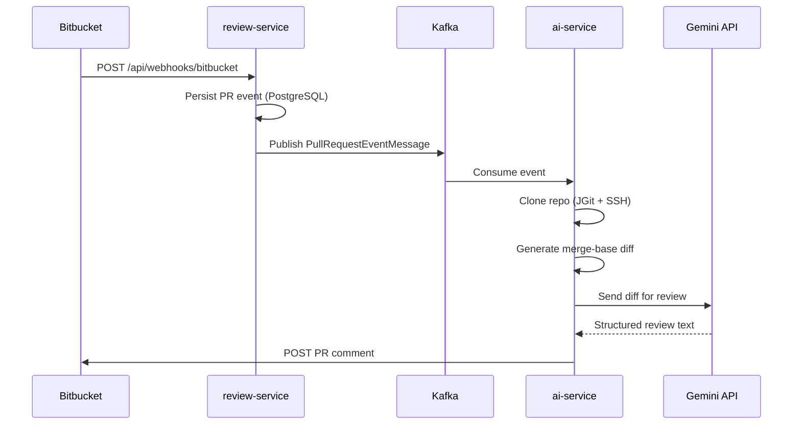

# AI Code Review Platform

An event-driven, microservices-based platform that automatically reviews Bitbucket pull requests using Google Gemini and posts structured feedback directly on the PR.

When a pull request is opened, the platform clones the repository, generates a merge-base git diff, sends it to Gemini for analysis, and publishes the review as a Bitbucket PR comment — fully asynchronously via Kafka.

---

## Architecture

```
Bitbucket PR (webhook)
        │
        ▼
┌───────────────────┐
│  review-service   │  :8082
│  Webhook + Kafka  │
└─────────┬─────────┘
          │  pr-review-events
          ▼
┌───────────────────┐
│    ai-service     │  :8083
│  Clone → Diff →   │
│  Gemini → Comment │
└─────────┬─────────┘
          │
          ▼
   Bitbucket PR comment
```



---

## Services

| Service | Port | Role |
|---------|------|------|
| **review-service** | `8082` | Receives Bitbucket webhooks, persists events, publishes to Kafka |
| **ai-service** | `8083` | Consumes Kafka events, clones repo, generates diff, calls Gemini, posts PR comment |
| **gateway-service** | `8080` | API gateway (routes auth + webhook paths) |
| **auth-service** | `8081` | JWT authentication (optional, via gateway) |
| **Kafka** | `9092` | Async messaging (`pr-review-events` topic) |
| **Zookeeper** | `2181` | Kafka coordination |
| **Redis** | `6379` | Available for future use |

---

## Tech Stack

- **Java 21** · **Spring Boot 3.5**
- **Apache Kafka** — async event pipeline
- **PostgreSQL** — PR event persistence (review-service)
- **JGit** — SSH repository cloning
- **Google Gemini 2.5 Flash** — AI code review
- **Bitbucket REST API** — PR comment posting
- **Spring WebClient** — HTTP clients with retry + timeout

---

## Prerequisites

- Java 21
- Docker & Docker Compose
- Maven (or use included `./mvnw` wrappers)
- SSH key configured for Bitbucket (`ssh -T git@bitbucket.org`)
- A public URL for webhooks (e.g. [ngrok](https://ngrok.com)) — Bitbucket cannot reach `localhost`

---

## Environment Variables

Add these to your shell profile (`~/.zshrc`) or export before starting services:

```bash
# Required — review-service
export DB_PASSWORD=your-postgres-password

# Required — ai-service
export GEMINI_API_KEY=your-gemini-api-key
export BITBUCKET_USERNAME=your-atlassian-email@example.com
export BITBUCKET_PASSWORD=your-bitbucket-api-token
```

| Variable | Used by | Description |
|----------|---------|-------------|
| `DB_PASSWORD` | review-service | PostgreSQL database password |
| `GEMINI_API_KEY` | ai-service | Google AI Studio API key |
| `BITBUCKET_USERNAME` | ai-service | Atlassian account email |
| `BITBUCKET_PASSWORD` | ai-service | Bitbucket API token ([create here](https://id.atlassian.com/manage-profile/security/api-tokens)) |

---

## Quick Start

### 1. Start infrastructure

```bash
cd ai-code-review-platform
docker compose up -d
```

### 2. Start review-service

```bash
cd review-service
./mvnw clean spring-boot:run
```

Wait for: `Started ReviewServiceApplication` on port **8082**.

### 3. Start ai-service

```bash
cd ai-service
./mvnw clean spring-boot:run
```

Wait for: `Started AiServiceApplication` on port **8083**.

> **Tip:** Always use `./mvnw clean spring-boot:run` after DTO or config changes to avoid stale classpath errors.

### 4. Expose the webhook endpoint

```bash
ngrok http 8082
```

Copy the HTTPS forwarding URL (e.g. `https://abc123.ngrok-free.app`).

### 5. Configure Bitbucket webhook

In your Bitbucket repo → **Repository settings → Webhooks → Add webhook**:

| Field | Value |
|-------|-------|
| **Title** | AI Code Review |
| **URL** | `https://<your-ngrok-url>/api/webhooks/bitbucket` |
| **Triggers** | Pull request created (optionally: updated) |

### 6. Open a test pull request

```bash
git checkout -b feature/test-ai-review
# make a small code change
git add . && git commit -m "test: trigger AI review"
git push -u origin feature/test-ai-review
```

Open a PR in Bitbucket. Within a minute you should see an AI-generated comment on the pull request.

---

## Kafka Event Schema

Topic: `pr-review-events`

```json
{
  "pullRequestId": 3,
  "title": "Feature/test webhook",
  "workspace": "my-workspace",
  "repositorySlug": "my-repo",
  "repositoryName": "my-repo",
  "sourceBranch": "feature/test-webhook",
  "targetBranch": "main",
  "author": "Jane Developer",
  "cloneUrl": "git@bitbucket.org:my-workspace/my-repo.git"
}
```

---

## Expected Logs

**review-service** (webhook received):

```
RAW WEBHOOK: { ... }
Pull Request Event Saved Successfully: 42
Publishing review event: PullRequestEventMessage(...)
```

**ai-service** (review posted):

```
Received PR Event: PR #3 in my-workspace/my-repo
Diff length = 1234
Generating AI review...
AI review generated for PR #3 (2847 chars)
Posting AI review comment to my-workspace/my-repo PR #3
Successfully posted AI review comment to my-workspace/my-repo PR #3
```

---

## Project Structure

```
ai-code-review-platform/
├── review-service/          # Bitbucket webhook + Kafka producer
│   ├── controller/          WebhookController
│   ├── service/             WebhookService
│   ├── dto/                 BitbucketWebhookRequest, PullRequestEventMessage
│   └── producer/            ReviewEventProducer
├── ai-service/              # Kafka consumer + AI pipeline
│   ├── consumer/            ReviewEventConsumer
│   ├── client/              GeminiClient, BitbucketClient
│   ├── service/             GitCloneService, GitDiffService, AIReviewService
│   └── dto/gemini/          Gemini response parsing
├── auth-service/            # JWT auth (standalone)
├── gateway-service/         # Spring Cloud Gateway
└── docker-compose.yml       # Kafka, Zookeeper, Redis
```

---

## Troubleshooting

| Symptom | Likely cause | Fix |
|---------|--------------|-----|
| `NoSuchMethodError: getLinks()` | Stale compiled classes | `./mvnw clean spring-boot:run` |
| Webhook never arrives | Bitbucket can't reach localhost | Use ngrok; verify webhook URL |
| Git clone fails | SSH key not configured | Run `ssh -T git@bitbucket.org` |
| `401` from Bitbucket API | Invalid credentials | Check email + API token env vars |
| Kafka connection refused | Infrastructure not running | `docker compose up -d` |
| No ai-service logs | Consumer started before Kafka | Restart ai-service after Kafka is up |
| Empty review | No diff detected | Verify source/target branches exist on remote |

---

## Resilience

Both HTTP clients (`GeminiClient`, `BitbucketClient`) include:

- Configurable **timeouts** (60s Gemini, 30s Bitbucket)
- **Exponential backoff retry** (3 attempts, skips 4xx except 429)
- Structured **error logging** with operation context

Configure in `ai-service/src/main/resources/application.yml` under `gemini.*` and `bitbucket.*`.

---

## License

This project is for educational and demonstration purposes.
